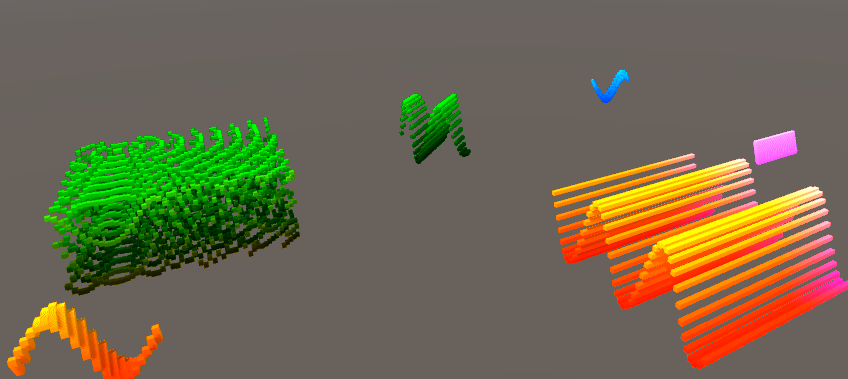
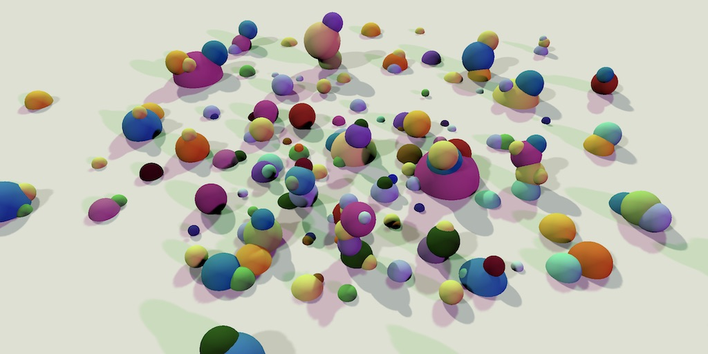
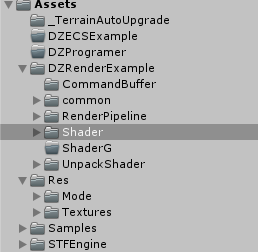
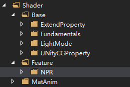
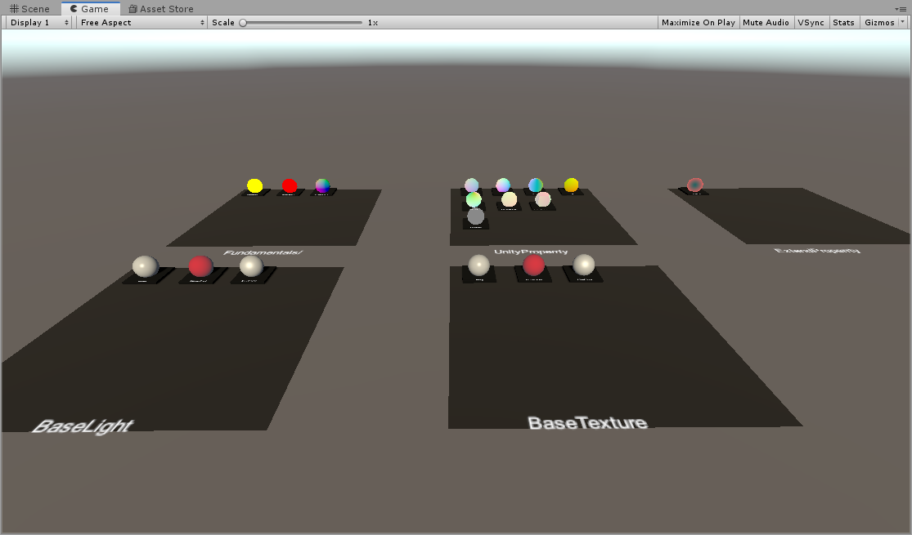
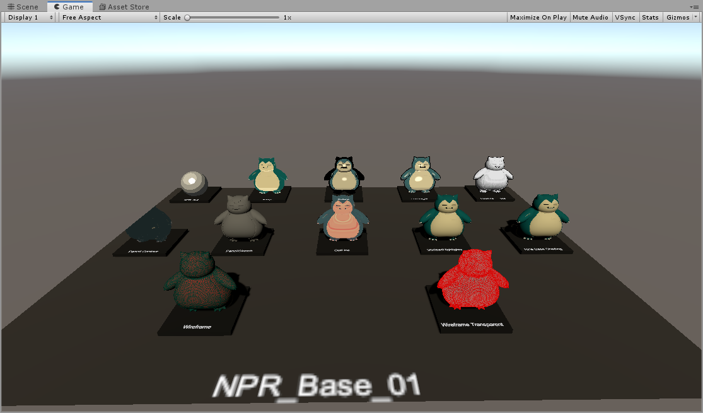

# UnityCodingArcFamily

 白袍小道

一些实验，给予Unity（同时转为Unreal 相差也容易）

1、Code Move
：各种代码运动，Trans运动，杂七杂八的  【函数CPU】--》JS 其实已经不少

2：Object Management:

3：Editor Tool:

4:Flow

5:Mesh Tool and Example :Code Arc

6:Scriptable Render Pipeline: 主要是Custom pipeLine ，Shadow ,CSM ，IBL，SH，BRDF/BSDF PBR 乱点
【部分Shader会参考Unreal 和 Unity cg,还有其他】

7：Rendering：  多了个去，Shader(VS,PS,CS,HS,细分），材质（分层，阴影，半透阴影，FOG，然后是光，GI，GPUIns],
其实Unity和UE都可以Custom的不少也不麻烦【实验为主，学习为主，瞎搞为主】。Realtime 经书也主要在这里

8：Advanced Rendering： Rendering部分会迁移到这里，也会加入一些看到的有趣算法，如DOF，Field Mesh,FXAA，SSAO/DHAO,Surface,
[都是GEM或者GPUPRO，Third 的小点]，Noise，Squares，

9：Example XXXX【集中于完整一些的渲染和动画相关的效果案例】

文档位于DOC下：

如下图是Code Move中SimplePos的部分，就放在CodeMove路径下

如下图是LightShadow的部分，就放在LightShadow路径下

Res: 				SRc Resouce 									原始资源

STFEngine: 	EngineExtendTool And FrameWork   引擎扩展工具和框架

ECS: 				JopSystem，DataDriver ，EntityComSystem_With Unity

Programmer:	Programming Mode，Texture, Anim

​							程序化的一些内容 如程序化动画 程序化纹理，图元 等【迁移过程中，持续】

Render：目录【迁移过程中，持续】

包含Shader、RenderPipeline、 etc.[部分代码中直接包含公式说明和DOC]

Unity-Shader-BaseProperty

Feature-NPR_Base

Shader/CS

<video id="video" controls="" preload="none">
       <source id="wmv" src="DOC/Render/Shader/Rec/ResC_CS01.mp4" type="video/mp4">
</video>

 

---------------------
版权声明：小道，转载请附上原文出处链接及本声明。

